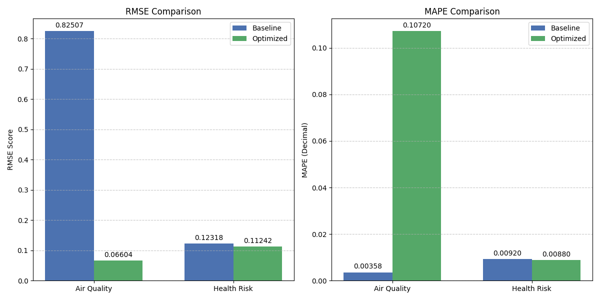

# Forecaster to Predict Air Quality and Health Risk Based on Weather Data

An implementation and analysis of XGBoost models for predicting air quality and health risk based on weather data. Model
performance is analyzed using RMSE and MAPE. Includes exploratory data analysis, feature engineering, and hyperparameter
tuning.

---

## Key Findings

- Both models exhibited low RMSE and MAPE scores, indicating strong potential for use in forecasting air quality and health
  risk.
- Analysis of feature importance and Shapley values revealed that dew was the most important feature for predicting both air quality and health risk.
- Air quality was not a strong predictor of health risk, possibly because dew acts as a better composite measure of pollutants than the custom air quality feature I engineered from the normalized values of the pollutants contained in the dataset.

---

## Brief Summary of Results



The initial air quality model suffered from data leakage and an unbalanced composite air quality feature. However, once these issues were addressed and hyperparameter tuning was applied, both models exhibited low RMSE and MAPE scores, indiciating strong potential for use in forecasting air quality and health risk.

---

## Repository Structure

```
├── src/
│   ├── data/
│   │   ├── raw/
│   │   └── processed/
│   ├── visualizations/
|   |   ├── air_quality_feature_importance.png
|   |   ├── air_quality_shap_analysis.png
|   |   ├── air_quality_shap_summary.png
|   |   ├── health_risk_feature_importance.png
|   |   ├── health_risk_shap_analysis.png
|   |   ├── health_risk_shap_summary.png
|   |   ├── initial_air_quality_feature_importance.png
|   |   ├── model_comparison_chart.png
│   │   └── pollutant_dist.png
│   ├── notebooks/
│   │   └── air_quality_and_health_risk_forecaster.ipynb
│   ├── evaluation_methods/
│   │   ├── calculate_feature_importance.py
│   │   ├── create_bar_graphs.py
│   │   └── shap_analysis.py
│   └── model_methods/
│       ├── implement_initial_model.py
│       └── optimize_model.py
├── requirements.txt
└── README.md
```

---

## Requirements

### Hardware

- **RAM**: 8GB minimum
- **CPU**: Any modern processor (no GPU required)
- **Storage**: <= 250MB for data, notebook, helper functions, and visualizations

### Software

- Python 3.10 or higher
- Jupyter Notebook or JupyterLab

### Python Packages

Install dependencies using:

```bash
pip install -r requirements.txt
```

Or install manually:

```
pandas          >= 1.5.0
numpy           >= 1.23.0
scikit-learn    >= 1.2.0
xgboost         >= 1.7.0
shap            >= 0.41.0
matplotlib      >= 3.6.0
notebook        >= 6.5.0
ipykernel       >= 6.19.0
```

---

## Instructions to Run

1. **Clone the repository**

```bash
   git clone git@github.com:zach-lloyd/air_quality_and_health_risk_forecaster.git
   cd air_quality_and_health_risk_forecaster
```

2. **Create a virtual environment (recommended)**

```bash
   python -m venv venv
   source venv/bin/activate  # On Windows: venv\Scripts\activate
```

3. **Install dependencies**

```bash
   pip install -r requirements.txt
```

4. **Launch Jupyter**

```bash
   jupyter notebook
```

5. **Run the notebook**
   - Navigate to src/notebooks/
   - Open air_quality_and_health_risk_forecaster.ipynb
   - Run all cells sequentially

   **Note**: The notebook will save model artifacts and visualizations to their respective directories.

---

## Dataset

The dataset used for this project contains weather and air quality measurements including temperature, humidity, dew point, and various pollutant concentrations. The engineered air quality and health risk features are derived from normalized pollutant values and serve as the target variables for the XGBoost models.

Data Location: src/data/raw/ and src/data/processed/

---

## Areas for Future Improvement

- More extensive hyperparameter tuning (due to time constraints, I limited most parameters to only a couple of different values each).
- More thorough exploration and analysis of the dataset. Due to time constraints, I mostly focused on analyzing and engineering the outcome variables. However, it would be interesting to also analyze the independent features to examine if there are any other opportunities to improve the models via normalization, feature engineering, etc.
- Feature addition. One of the most surprising findings was that dew is more predictive of health risk than a normalized average of the three pollutants contained in the dataset. This could be because dew collects pollutants and thus acts as a more robust measure of the presence of pollutants in the air. It would be interesting to see how the results change if additional pollutant features, or other features related to pollution and air quality, were added to the dataset.

---

## References

- ApX. (n.d.). Tuning the Number of Estimators and Learning Rate. https://apxml.com/courses/gettingstarted-with-gradient-boosting-algorithms/chapter-6-hyperparameter-tuning-and-optimization/tuning-estimators-and-learning-rate.

- Brownlee, J. (2021). XGBoost for Regression. Machine Learning Mastery. https://machinelearningmastery.com/xgboost-for-regression/.

- bugfree.ai. (n.d.). Detecting and Handling Multicollinearity in Features. https://bugfree.ai/knowledge-hub/detecting-handling-multicollinearity-features.

- Cezayirli, B. (2025). A Comprehensive Guide to Hyperparameter Tuning in XGBoost. https://barancezayirli.com/blog/ai/a-comprehensive-guide-to-hyperparameter-tuning-in-xgboost.

- Chen, T., & Guestrin, C. (2016). XGBoost: A Scalable Tree Boosting System. Proceedings of the 22nd ACM SIGKDD International Conference on Knowledge Discovery and Data Mining. https://arxiv.org/abs/1603.02754.

- GeeksforGeeks. (2025). Ridge Regression. https://www.geeksforgeeks.org/machine-learning/what-is-ridge-regression/.

- Hyndman, R. and Athanasopoulos, G. (2018). Forecasting: Principles and Practice. https://otexts.com/fpp2/.

- Kaur, G. (2024). Mastering MAPE: A Guide to Understanding and Using Mean Absolute Percentage Error. Medium. https://medium.com/@pirthipalsingh138/mastering-mape-a-guide-to-understanding-and-using-mean-absolute-percentage-error-8fd88f347eaa.

- Nkomo, B. (2021). The Higgs Boson Machine Learning Challenge in the CERN Large Hadron Collider. https://brightonnkomo.medium.com/the-higgs-boson-machine-learning-challenge-in-the-cern-large-hadron-collider-8520b709686d.

- Ravindran, R. (2023). Overfitting and Pruning in Decision Trees — Improving Model’s Accuracy. https://medium.com/nerd-for-tech/overfitting-and-pruning-in-decision-trees-improving-models-accuracy-fdbe9ecd1160.

- Reality Pathing. (2025). What Does Dew Reveal About Environmental Health? https://realitypathing.com/what-does-dew-reveal-about-environmental-health/.

- Simplilearn. (2025). Bagging in Machine Learning: Step to Perform and Its Advantages. https://www.simplilearn.com/tutorials/machine-learning-tutorial/bagging-in-machine-learning.

- Smith, C. (2019). Penalizing Complexity. https://camtsmith.com/articles/2019-08/regularization.

- SoulPage. (n.d.). L1 Regularization. https://soulpageit.com/ai-glossary/l1-regularization-explained/.

- Stack Exchange. (2022). What is the purpose behind tuning the n_estimators parameter in XGBoost? https://stats.stackexchange.com/questions/592936/what-is-the-purpose-behind-tuning-n-estimators-in-xgboost.

- Wikipiedia. (Last accessed January 9, 2025). Mean absolute percentage error. https://en.wikipedia.org/wiki/Mean_absolute_percentage_error.
